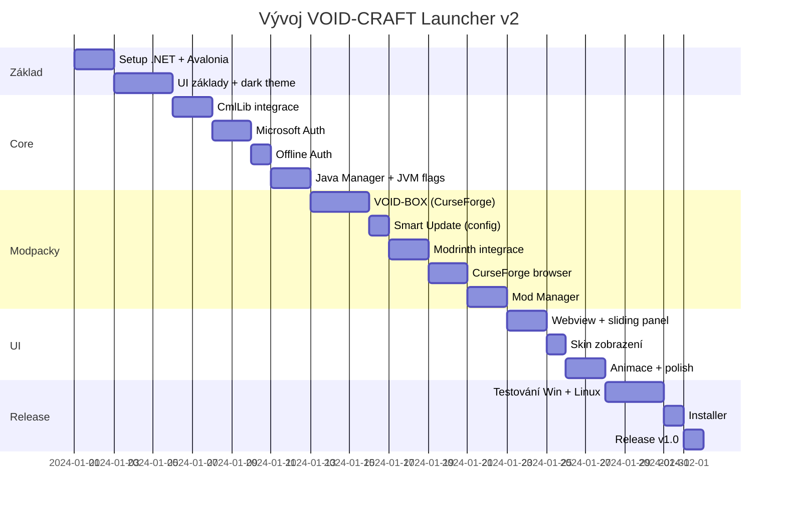

# VOID-CRAFT Minecraft Launcher v2

Nový, stabilní Minecraft launcher postavený na **C# + Avalonia UI + CmlLib.Core** pro komunitu VOID-CRAFT.

---

## Přehled

| Vlastnost | Hodnota |
|-----------|---------|
| **Framework** | C# + Avalonia UI (.NET 8) |
| **MC Core** | CmlLib.Core |
| **Cílová platforma** | Windows, Linux, macOS |
| **Hlavní modpack** | [VOID-BOX](https://www.curseforge.com/minecraft/modpacks/void-box2) (CurseForge) |
| **Webview** | void-craft.eu |

---

## Proč Avalonia UI?

> **"The open-source WPF successor for building beautiful, cross-platform .NET apps"**

| | Avalonia | WPF | Electron |
|--|----------|-----|----------|
| **Cross-platform** | ✅ Win/Linux/Mac | ❌ Windows only | ✅ |
| **XAML** | ✅ Stejné jako WPF | ✅ | ❌ |
| **Výkon** | ⭐⭐⭐⭐⭐ | ⭐⭐⭐⭐⭐ | ⭐⭐ |
| **RAM** | ~50-80 MB | ~50-80 MB | ~150-300 MB |
| **Stabilita** | ⭐⭐⭐⭐ | ⭐⭐⭐⭐⭐ | ⭐⭐⭐ |

### Výhody Avalonia:
- ✅ **Cross-platform** - jeden kód pro Windows, Linux, macOS
- ✅ **XAML syntax** - podobné WPF, snadný přechod
- ✅ Aktivní komunita (10k+ GitHub stars)
- ✅ Moderní, pravidelně aktualizované
- ✅ Podpora pro WebView

---

## Technologie

### Stack

| Komponenta | Technologie | Balíček |
|------------|-------------|---------|
| **UI Framework** | Avalonia UI | Avalonia |
| **Minecraft Core** | CmlLib.Core | NuGet |
| **Microsoft Auth** | CmlLib.Core.Auth.Microsoft | NuGet |
| **Webview** | Avalonia.WebView | NuGet |
| **HTTP Client** | HttpClient + RestSharp | NuGet |
| **JSON** | System.Text.Json | .NET 8 |
| **MVVM** | CommunityToolkit.Mvvm | NuGet |

### Struktura projektu

```
VoidCraftLauncher/
├── VoidCraftLauncher.sln
├── src/
│   ├── VoidCraftLauncher/           # Hlavní Avalonia aplikace
│   │   ├── App.axaml                # Avalonia XAML
│   │   ├── MainWindow.axaml         # Hlavní okno
│   │   ├── Views/
│   │   │   ├── HomeView.axaml       # Hlavní pohled s modpackem
│   │   │   ├── ModpackBrowserView.axaml
│   │   │   ├── SettingsView.axaml
│   │   │   ├── ModManagerView.axaml # Zapnutí/vypnutí modů
│   │   │   └── AccountView.axaml
│   │   ├── ViewModels/              # MVVM
│   │   ├── Models/
│   │   ├── Services/
│   │   │   ├── LauncherService.cs   # CmlLib wrapper
│   │   │   ├── AuthService.cs       # Microsoft + Offline auth
│   │   │   ├── ModrinthApi.cs
│   │   │   ├── CurseForgeApi.cs
│   │   │   ├── JavaManager.cs
│   │   │   ├── JvmFlagsService.cs
│   │   │   └── UpdateService.cs
│   │   ├── Controls/                # Custom controls
│   │   ├── Themes/                  # Dark theme styly
│   │   └── Assets/
│   └── VoidCraftLauncher.Core/      # Shared library
├── assets/
│   ├── icons/
│   └── images/
└── installer/                        # Windows: Inno Setup, Linux: AppImage
```

---

## UI Design

### Hlavní layout

```
┌─────────────────────────────────────────────────────────────────────┐
│  VOID-CRAFT LAUNCHER                                    [─] [□] [×] │
├─────────────────────────────────────┬───────────────────────────────┤
│                                     │                               │
│  ┌─────────────────────────────┐    │                               │
│  │  [SKIN IMG]  Username       │    │                               │
│  │              ▼ Přepnout     │    │      WEBVIEW                  │
│  └─────────────────────────────┘    │      (void-craft.eu)          │
│                                     │                               │
│  ┌─────────────────────────────┐    │      ═══════════════          │
│  │     VOID-BOX MODPACK        │    │      Slouží také jako:        │
│  │     Verze: 1.2.3            │    │      • Nastavení              │
│  │     MC 1.20.1 + NeoForge    │    │      • Prohlížeč modpacků     │
│  │                             │    │      • Správa modů            │
│  │     ████████████░░░ 80%     │    │                               │
│  │     Stahování: mod.jar      │    │                               │
│  │                             │    │                               │
│  │  [▶ SPUSTIT]   [⚙]  [🔧]   │    │                               │
│  └─────────────────────────────┘    │                               │
│                                     │                               │
│  ┌─────────────────────────────┐    │                               │
│  │  [+] Přidat modpack         │◄───┼── Klik = animace zleva        │
│  │      → Otevře se v pravé    │    │      překryje webview         │
│  │        části (webview area) │    │                               │
│  └─────────────────────────────┘    │                               │
│                                     │                               │
│  Další modpacky:                    │                               │
│  ┌──────────┐ ┌──────────┐         │                               │
│  │ Pack 1   │ │ Pack 2   │         │                               │
│  │ [▶][✎][🗑]│ │ [▶][✎][🗑]│         │                               │
│  └──────────┘ └──────────┘         │                               │
│                                     │                               │
├─────────────────────────────────────┴───────────────────────────────┤
│  RAM: [████████████░░░░] 12 GB                        [Optimalizace ✓]│
└─────────────────────────────────────────────────────────────────────┘
```

### Design principy
- **Zobrazení skinu** hráče vedle jména
- **Sliding panel** zleva pro prohlížeč modpacků (překryje webview)
- **Webview jako pracovní plocha** - pro nastavení, editaci modpacků, atd.
- **Detailní progress** - vidět vše co se děje (stahování, co se loaduje)
- **Možnost smazat modpacky** jednotlivě (ikona 🗑)
- **Možnost editovat mody** - zapnout/vypnout (ikona ✎ nebo 🔧)
- **Dark theme s glassmorphism**
- **Animace** - plynulé přechody, loading indikátory

---

## Klíčové funkce

### 1. VOID-BOX Modpack (hlavní)
- **Automatické načtení info** z CurseForge API
- **URL**: https://www.curseforge.com/minecraft/modpacks/void-box2
- **Smart update** - NEPŘEPISOVAT:
  - `options.txt`
  - složku `config/`
  - Pouze pokud již existují!
- **Detekce změn** - stahovat pouze změněné soubory

### 2. Prohlížeč modpacků (Modrinth + CurseForge)
- Vyhledávání a filtrování
- Instalace jedním kliknutím
- **Správa instancí**:
  - Spustit
  - Upravit (zapnout/vypnout mody)
  - Smazat

### 3. Správa modů
- Seznam modů v modpacku
- Toggle pro zapnutí/vypnutí
- Přidání vlastních modů

### 4. Autentizace
- **Microsoft účet** (primární)
- **Offline/Warez režim** (pro uživatele bez licence)
- Bezpečné ukládání tokenů
- Zobrazení skinu

### 5. Java Management
- **Automatická detekce** nainstalované Javy
- **Automatický výběr verze** podle MC verze modpacku:
  - MC 1.16 a starší → Java 8
  - MC 1.17 → Java 16
  - MC 1.18-1.20.4 → Java 17
  - MC 1.20.5+ → Java 21
- **Automatická úprava JVM flagů** podle verze Java
- Pro VOID-BOX: **Java 21** (nejlepší)
- Možnost stáhnout doporučenou Javu (Adoptium)

### 6. RAM a JVM Nastavení
- **Výchozí RAM: 12 GB**
- **První spuštění modpacku** = dotaz na RAM
- Slider pro úpravu (min/max stejné)
- Toggle pro optimalizované flagy
- Advanced: ruční úprava flagů

---

## JVM Flagy

Podle [brucethemoose benchmarks](https://github.com/brucethemoose/Minecraft-Performance-Flags-Benchmarks):

### Base Flags (Java 11+)
```
-XX:+UnlockExperimentalVMOptions
-XX:+UnlockDiagnosticVMOptions
-XX:+AlwaysActAsServerClassMachine
-XX:+AlwaysPreTouch
-XX:+DisableExplicitGC
-XX:+UseNUMA
-XX:NmethodSweepActivity=1
-XX:ReservedCodeCacheSize=400M
-XX:NonNMethodCodeHeapSize=12M
-XX:ProfiledCodeHeapSize=194M
-XX:NonProfiledCodeHeapSize=194M
-XX:-DontCompileHugeMethods
-XX:MaxNodeLimit=240000
-XX:NodeLimitFudgeFactor=8000
-XX:+UseVectorCmov
-XX:+PerfDisableSharedMem
-XX:+UseFastUnorderedTimeStamps
-XX:+UseCriticalJavaThreadPriority
-XX:ThreadPriorityPolicy=1
-XX:AllocatePrefetchStyle=3
```

### G1GC Flags (pro klienty)
```
-XX:+UseG1GC
-XX:MaxGCPauseMillis=37
-XX:G1HeapRegionSize=16M
-XX:G1NewSizePercent=23
-XX:G1ReservePercent=20
-XX:SurvivorRatio=32
-XX:G1MixedGCCountTarget=3
-XX:G1HeapWastePercent=20
-XX:InitiatingHeapOccupancyPercent=10
-XX:G1RSetUpdatingPauseTimePercent=0
-XX:MaxTenuringThreshold=1
-XX:G1SATBBufferEnqueueingThresholdPercent=30
-XX:G1ConcMarkStepDurationMillis=5.0
-XX:G1ConcRSHotCardLimit=16
-XX:G1ConcRefinementServiceIntervalMillis=150
-XX:GCTimeRatio=99
```

### Automatická úprava podle verze Java
- Java 8: Upravené flagy (některé neexistují)
- Java 11-16: Base + G1GC
- Java 17+: Plné flagy
- Java 21: Plné flagy + případné nové optimalizace

---

## API Integrace

### CurseForge API
- **Endpoint**: `https://api.curseforge.com`
- **Vyžaduje**: API Key
- **Funkce**:
  - Načtení info o VOID-BOX modpacku
  - Vyhledávání modpacků
  - Stahování souborů

### Modrinth API
- **Endpoint**: `https://api.modrinth.com/v2`
- **Nevyžaduje**: API Key (veřejné)
- **Funkce**:
  - Vyhledávání modpacků
  - Stahování .mrpack souborů

### Minecraft Skin API
- **Endpoint**: `https://crafatar.com` nebo Mojang API
- **Funkce**: Načtení a zobrazení skinu hráče

---

## Co potřebuji

> [!IMPORTANT]
> ### Od tebe potřebuji:
> 
> 1. **CurseForge API Key** - z tvého starého launcheru nebo nový
> 2. **Azure App ID** - pro Microsoft auth (pokud máš, jinak vytvořím)
> 3. **Branding** - logo, barvy (dodáš později - OK)

### Jak získat CurseForge API Key
Pokud nemáš z původního launcheru:
1. Jdi na https://console.curseforge.com/
2. Vytvoř nový projekt
3. Získej API key

### Jak získat Azure App ID
1. Jdi na https://portal.azure.com
2. Azure Active Directory → App registrations → New
3. Redirect URI: `http://localhost`
4. Zkopíruj Application (client) ID

---

## Verification Plan

### Automatické testy
```bash
# Build
dotnet build

# Run tests
dotnet test

# Publish Windows
dotnet publish -c Release -r win-x64 --self-contained

# Publish Linux
dotnet publish -c Release -r linux-x64 --self-contained
```

### Manuální testování
1. ✅ Microsoft přihlášení
2. ✅ Offline přihlášení (warez)
3. ✅ Stažení VOID-BOX modpacku
4. ✅ Update modpacku (ověřit že se nepřepíše config)
5. ✅ Spuštění hry s JVM flagy
6. ✅ Modrinth vyhledávání + instalace
7. ✅ CurseForge vyhledávání + instalace
8. ✅ Smazání modpacku
9. ✅ Zapnutí/vypnutí modů
10. ✅ Webview void-craft.eu
11. ✅ Zobrazení skinu
12. ✅ Test na Windows
13. ✅ Test na Linux

---

## Harmonogram



---

## Shrnutí požadavků (zapracováno)

| Požadavek | Status |
|-----------|--------|
| C# místo Electronu | ✅ Avalonia UI + CmlLib.Core |
| Cross-platform (Win + Linux) | ✅ Avalonia UI |
| Web void-craft.eu | ✅ Avalonia WebView |
| Modpack z CurseForge | ✅ Auto-load z API |
| Smazat modpacky | ✅ UI s ikonou 🗑 |
| Nepřepisovat config/options.txt | ✅ Smart update |
| Sliding panel pro browser | ✅ Animace zleva |
| Webview jako workspace | ✅ Pro settings, mody, atd. |
| Zobrazení skinu | ✅ Crafatar API |
| Detailní progress | ✅ Vidět vše co se děje |
| Branding | ⏳ Dodáš později |
| Auto Java podle MC verze | ✅ Automatická detekce |
| Java 21 pro VOID-BOX | ✅ |
| RAM 12 GB default | ✅ + dotaz při prvním spuštění |
| Zapnout/vypnout mody | ✅ Mod Manager |
| Warez podpora | ✅ Offline auth |
| API klíče | ⏳ Potřebuji od tebe |
